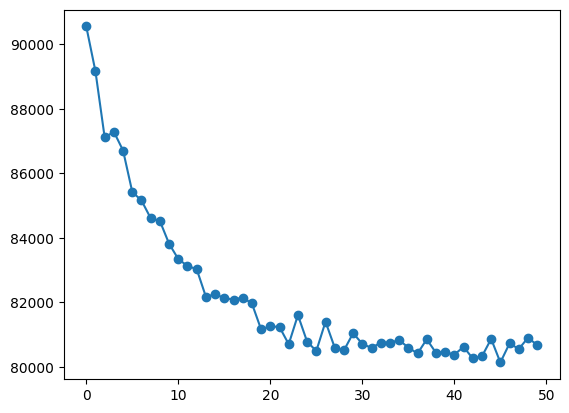
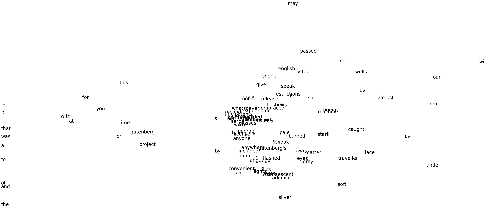

# 1. Introduction

In order for a computer to understand words and build a MT system or a text summarization model, etc, we need to transform the words into `vectors`. There are a few ways of doing that: 

* **One-hot representation**. We build a V orthongal dimension space, where each axis correspond to a word and V is the length of our vocabulary. For example, if the word: *a* is the first word in our vocabulary, its vector representation is: [1, 0, 0, ...] (length of V). 

The problem with this kind of representation is that all the words are orthonogal from each other. That means that the word `hello` is as similar as `bye` and `physics`. In an ideal system, the word *hello* should be closer to the word *bye* than the word *physics* in order to extract some meaning from a sentence. Some common algorithms that solve this issue are: 

* **Word2Vec**. This is the algorithm we will implement from scratch. 
* **GloVe**. For more information consult: https://nlp.stanford.edu/pubs/glove.pdf. 

# 2. Word2Vec

The scratch implementation that you will find in the `classes/word2vec.py` file, uses the `skip-gram` cost function with negative sampling. Such cost function for a single window is given by: 

$$
\begin{equation}
J_{skip-gram} = \sum_{-m \leq j \leq m | j \neq 0} J_{neg-sample}(\mathbf{v}_t, w_{t+j})
\end{equation}
$$

where $w_{t+j}$ is the word in the window at position $t+j$ respect the center word which is at position $t$ and where $J_{neg-sample}$ is given by: 

$$
\begin{equation}
J_{neg-sample} = -\log \sigma (\mathbf{u}_0^T \mathbf{v_c}) - \sum_{s=1}^{K} \log(1 - \sigma (\mathbf{u}_s^T \mathbf{v_c}))
\end{equation}
$$

where $\mathbf{u}_0$ is the outside word, $\mathbf{v}_c$ is the center word of a given window and $\mathbf{u}_s$ is a sampled word. 

The intuition behind this cost function is: 
- We want to maximize (minimize the negative logarithm) similarity of the words: {$\mathbf{u}_0$, $\mathbf{v}_c$}. 
- We want to punish the similarity of the words: {$\mathbf{u}_s$, $\mathbf{v}_c$}. Since $\mathbf{u}_s$ is a sampled word, the probability that it has some relation with the center word is very little so that is why we want to punish that similarity. 

In the `theory/theory_w2v.pdf` file you can find the derivation of the backpropagation equations, equations needed to create a scratch implementation of this algorithm. 

# 3. Training

In order to train this algorithm we need a dataset. I've used the Time Machine history to train the model. This dataset can be found in the `data/timemachine.txt` file. 

In order to make everything more clean, a `Vocabulary` class has been created. You will find this class in the `classes/vocabulary.py` file. 

The parameters chosen to train the model: 
* **max words**: 15 000. We will use the first 15 000 words so that it does not take too much time. 

* **epochs**: 50

* **learning rate**: 0.02

* **window size**: 2. Two words from the left and two from the right of the center word. Total words in a window: 5

* **negative sampling words**: 2. 2 words will be chosen from the vocabulary randomly at each window in order to diminsh the similarity between the center word and the random words. This words will be drawn according to the distribution of the equation (3). U(w) is the unigram distribution (number of times a single word appears in the dataset) and Z is the total number of words. 

$$
\begin{equation}
(\frac{U(w)}{Z})^{\frac{3}{4}}
\end{equation}
$$

* **embedding dimension**: 300. 

In the next figure we can see how the cost function diminsh as a function of time: 

The notebook where you will find the code is the `test.ipynb` notebook. 

# 4. Visual Vector Space

Using PCA we can see how the words have been rearranged in a 2D space (in this image there are only the first 100 words of the dataset): 

The distance from the origin have been clipped in order to see better the results. As we can see, the conexions like: *of, and, the, it, that, in, with, at, ...* are at the left side of the image while some important words of the dataset remain in the center. 

# 5. Relation words results

In this section I want to show you some relation the Word2Vec algorithms has learned from this dataset: 

* Input words: 'travel through' $\implies$ 'dimensions' as the most probable. 
* Input words: 'time' $\implies$ 'traveller' as the most probable. Next option: 'machine'. 
* Input words: 'travel dimensions' $\implies$ 'years', 'wrong' as the most probable words. 

# 6. Conclusions

Even with a very small dataset (15 000 words), the model has learned a lot: 

1. The prepostions are closer to each other that to any other word. 
2. The dataset is a story about time machines, and the model has recognized that the words: *dimensions*, *time*, *machine* are the most similar words when we input some sequence that has to do with this things. 

With a bigger dataset we should be able to learn some other dependices such as language analogies and logic: **a:b $\implies$ c: d**
