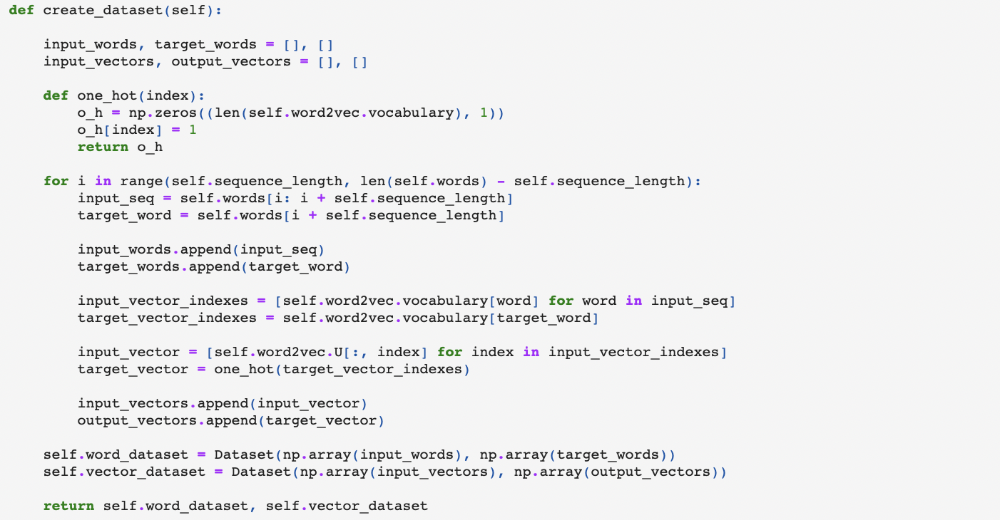
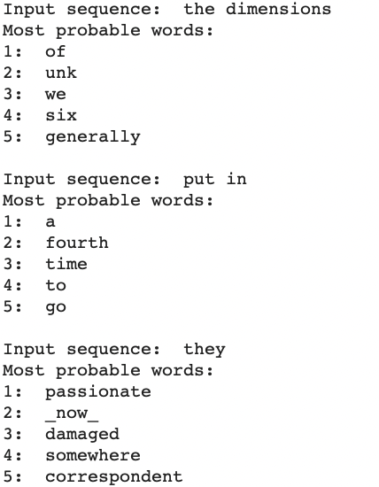

# 1. Introduction

Using a `scratch implementation` of a Recurrent Neural Network and a `scratch implementation` of Word2Vec algorithm, we want to predict the next word given an input sequence. 

The dataset used to build this model can be found in the `data/timemachine.txt` file. 

The scratch implementation of the RNN and Word2Vec can be found in the `data` folder. 

* In the `Next_Word_Prediction.ipynb` notebook is the application for predicting the next word. 
* In the `Simple_next_value_prediction.ipynb` noteboos is a simple application of predicting the next value of a sequence. In this example the next value of a sin function has been predicted using the scratch implementation of the RNN. 

# 2. Recurrent Neural Networks
In order to implement a scratch implementation, is necessary to derive the forward and backpropagation equations of a Recurrent Neural Networks. 

## 2.1 Forward propagation
**Hidden and prediction state at time step t**

$$
\begin{equation}
h_t = f(W h_{t-1} + U i_t + b) \hspace{1cm} \hat{y}_t = \text{softmax}(V h_t)
\end{equation}
$$

## 2.2 Backpropagation through time

This section is not going to be a step-by-step derviation of the backpropagation equations. Looking at the equations of the forward propagation and applying the chain rule, if you have some knowloedge of vector calculus, this task is straightforward. Nevertheless, in my github repository: https://github.com/jimysancho/Weather-Forecasting/ you can find the derivation of the backpropagation equations of the  more complex unit `LSTM` in the file: `Math_lstm.pdf` which can served you as a reference to derive this equations. Maybe in the future I will upload a pdf file with a step-by-step derivation. 

$$
\begin{equation}
\delta V = \sum_t \delta \hat{y}_t \frac{\partial \hat{y}_t}{\partial V} = \sum_t (\delta \hat{y}_t \odot \frac{\partial \text{softmax}}{\partial (V h_t)}) h_t^T
\end{equation}
$$

$$
\begin{equation}
\delta h_t = V^T (\delta \hat{y}_t \odot \frac{\partial \text{softmax}}{\partial (V h_t)}) + W^T (\delta h_{t+1} \odot \frac{\partial f}{\partial x} |_t)
\end{equation}
$$
where the derivative of $f$ is evaluated at the input of $f$ at time step t. 
$$
\begin{equation}
\delta W = \sum_t (\delta h_t \odot \frac{\partial f}{\partial x}|_{t}) h_{t-1}^T
\end{equation}
$$

$$
\begin{equation}
\delta U = \sum_t (\delta h_t \odot \frac{\partial f}{\partial x}|_{t}) x_t^T
\end{equation}
$$

$$
\begin{equation}
\delta b = (\delta h_t \odot \frac{\partial f}{\partial x}|_{t})
\end{equation}
$$

# 3. Next word prediction

The first thing we need to do is to train the Word2Vec on some data so that we can feed to the recurrent neural networks the word embeddings. 
Next, we will use the words: 1000-1400 of the dataset in order to train the neural network. 

## 3.1 Preprocessing 

We are using an RNN model to solve a `many-to-one` problem. The input is a sequence of words and the output is a single word. We need to create this type of data accordingly. In order to so in a simple and cleaner way, a couple of classes have been created: 

1. **Dataset**: it makes easy the task of iterating over the data. 
2. **Model**: it creates the dataset for the *many-to-one* problem. Once the word2vec had been trained, the *model* object takes as input the word2vec in order to create the dataset using the trained word embedings. 

The Dataset class: 

And the important method of the Model class: 

With these two utils the dataset is created so we can begin to train the neural network. 

## 3.2 Training

**RNN hyperparameters**
* Learning rate: 0.005
* Hidden units: 80
* Input units: dimension of the word embeddings (300)
* Output units: length of the vocabulary (the output function is a softmax layer in order to make probability predictions)
* Epochs: 100

The function that handles the traininig is the next method of the Model class: 

After applying this function, we can see how the cost diminsh as the training advances: 

# 4. Results
The model appears to be working. Let's see how it performs on different datasets: 
* Training set: words 1000-1400 of the timemachine.txt file. 
* Test set: some invented sequences but a little related with the book. 

## 4.1 Training set
* **Accuracy**: 63.1 %. 
* **Examples**: 

## 4.2 Test set

Let's have in mind that the dataset used has been very small, both to work the word2vec model and the RNN model. However, if the input sequences we create are a little related with the book, the options we get are actually coherent: 

# 5. Conclusions

We have managed to make a next word prediction application "works" (since we barely used any data) from scratch. 

Using more data to train the word2vec and more data to train the neural network, i have no doubt that the results will be promising. 